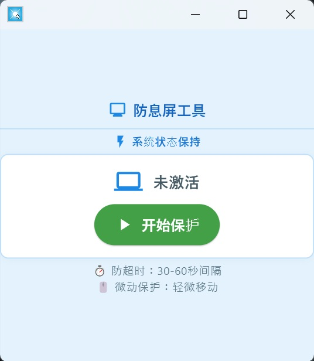

# 防息屏工具 (Screen Protection Tool)

一款现代化、美观、专业的防息屏与防网页超时工具。



## ✨ 功能特性

- **✨ 现代美观的UI**：采用现代化设计语言，界面简洁、专业、用户体验良好。
- **🚀 一键式操作**：单击按钮即可启动或停止保护，操作直观、高效。
- **📊 清晰的状态反馈**：通过图标和颜色变化，实时展示工具的“保护中”或“未激活”状态。
- **🧠 智能保护引擎**：在后台模拟轻微的鼠标移动，有效防止系统进入休眠或锁屏，并防止网页会话超时。
- **📌 窗口置顶**：默认置顶，确保在处理其他任务时也能方便地访问和控制。
- **🎨 自由缩放**：窗口大小可调，满足不同用户的屏幕空间需求。

## 🛠️ 技术栈

- **Python 3.8+**
- **Flet**: 用于构建跨平台的现代化用户界面。
- **PyAutoGUI**: 用于执行核心的自动化防息屏操作。

## 🚀 快速开始

### 方式一：直接运行（推荐）

1.  从本项目的 **[GitHub Releases](https://github.com/lanzhitu/moyu-tool/releases)** 页面下载最新的“绿色版”压缩包（例如 `Screen.Protection.Tool.v1.0.0.zip`）。
2.  解压后，直接双击运行 `防息屏工具.exe` 即可。无需安装，不写注册表。

### 方式二：从源码运行

如果希望从源码运行或进行二次开发，请按以下步骤操作：

```bash
# 1. 克隆仓库
git clone https://github.com/lanzhitu/moyu-tool.git
cd moyu-tool

# 2. 安装依赖
pip install -r requirements.txt

# 3. 运行主程序
python main.py
```

## 📦 自行构建

本项目提供了一个一键式构建脚本，用于打包生成“绿色版”发布包。

```bash
# 运行构建脚本
python build_release.py
```

构建完成后，所有用于发布的文件（包括 `exe`、说明文档等）将位于 `dist/release` 目录下。

## 📄 开源许可证

本项目基于 [MIT License](LICENSE) 开源。
